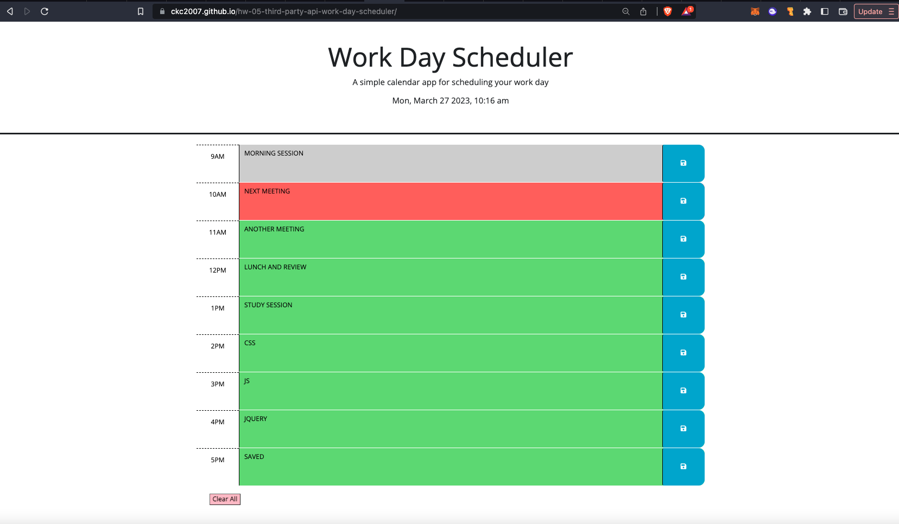
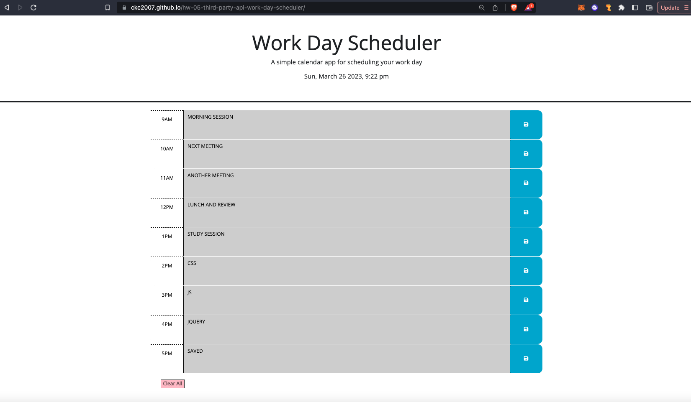

# hw-05-third-party-api-work-day-scheduler

## Description

````
This is a simple calendar application that saves user input to time-blocked elements - allowing the user to save text information in a display that will dynamically update with the time of day. This dynamic feature is powered by jQuery.

[Day.js](https://day.js.org/en/)

## User Story

```
AS A student with a busy schedule
I WANT to save my schedule to a daily planner
SO THAT I can see what I have to do today
````

## Acceptance Criteria

```
GIVEN I am using a daily planner to create a schedule
WHEN I open the planner
THEN the current day, date, and time is displayed at the top of the calendar
WHEN I scroll down
THEN I am presented with timeblocks for standard business hours
WHEN I view the timeblocks for that day
THEN each timeblock is color coded to indicate whether it is in the past, present, or future
WHEN I click into a timeblock
THEN I can enter an event (text)
WHEN I click the save button for that timeblock
THEN the text for that event is saved in local storage
WHEN I refresh the page
THEN the saved events persist
```

## Deployed Page

```
Here is the link to the live site:
[https://ckc2007.github.io/hw-05-third-party-api-work-day-scheduler/]

The following images show the deployed site at different times of day:



```

## Additional Features

```
Added a 'Clear All' button at the bottom left of the planner to allow the user to reset the conents of the planner
```

## Future Features

```
A dotted line that will scroll down through the calendar marking the time increments in real time, so the user can see a more specific time of day
```
